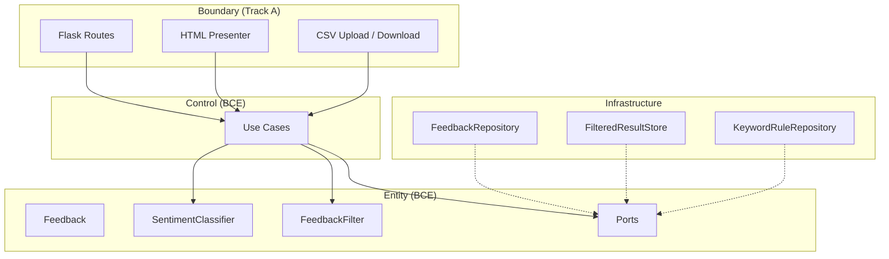

# Feedback Analyzer (Python/Flask)

키워드 기반으로 고객 피드백을 감정·카테고리 분류하고, 웹 대시보드에서 집계·필터·CSV 다운로드를 제공하며, **계약(Invariant)·pytest·Boundary→Control→Entity** 로 레거시 코드를 개선하는 **리팩토링·TDD 학습** 프로젝트입니다.

> 상세 요구사항: [`doc/PRD.md`](doc/PRD.md) · 학습 로드맵: [`project_purpose.md`](project_purpose.md) · AI/개발 규칙: [`.cursorrules`](.cursorrules)

---

## 목차

- [개요 (Overview)](#개요-overview)
- [빠른 시작 (Quick Start)](#빠른-시작-quick-start)
- [지원 감정·카테고리 및 키워드 기준](#지원-감정카테고리-및-키워드-기준)
- [입력 형식 계약](#입력-형식-계약)
- [아키텍처](#아키텍처)
- [테스트 실행](#테스트-실행)
- [설정 파일 (KeywordRule)](#설정-파일-keywordrule-file-db--jsonyaml)
- [출력 포맷](#출력-포맷)
- [생성형 AI 활용 Activities](#생성형-ai-활용-activities)
- [기여 가이드](#기여-가이드)
- [라이선스](#라이선스)
- [관련 문서](#관련-문서)
- [TO-DO LIST](#to-do-list)

---

## 개요 (Overview)

### 이 프로젝트가 해결하는 문제

| 문제 | 현재 코드 증상 | 학습자에게 주는 메시지 |
|------|----------------|------------------------|
| God Function | `app.py`에 라우팅·HTML·흐름 혼재 | UI 변경이 분류 로직까지 깨뜨림 |
| 이중 감정 규칙 | `constants.SENTIMENT_KEYWORDS` ≠ `filters.S_KEYWORDS` | Analyze 집계 ≠ Filter 결과 |
| 전역 상태 | `fil_data`, `global_sent`, `global_kw` | 다운로드·집계가 요청 간 엉킴 |
| 세션 설계 | `Session.current_feedbacks` 클래스 변수 | 테스트·다중 사용자 격리 불가 |
| 중립 필터 | 규칙 불일치 | 「중립」 필터가 기대와 다름 |

자세한 배경: [`doc/PRD.md` §1.2](doc/PRD.md).

### 측정 목표 ([`doc/PRD.md` §1.3](doc/PRD.md))

| ID | 요약 | 목표값 |
|----|------|--------|
| G-1 | entity·control 커버리지 | ≥ 90% |
| G-2 | Analyze = Filter 감정 | **INV-SENT-002** |
| G-3 | 중립 필터 | **INV-SENT-003** |
| G-4 | 감정 건수 합 | **INV-COUNT-002** |
| G-5 | 입·출력 계약 | 공백-only·원문·0건·CSV 스냅샷 |

### 비목표 ([`doc/PRD.md` §1.4](doc/PRD.md))

| ID | 제외 |
|----|------|
| NG-1 | 딥러닝·LLM 감정 분석 |
| NG-2 | `Cursor AI_퀴즈 - 문제.docx` 반영 |
| NG-3 | 프로덕션 배포·인증·다국어 UI |

### 사용자 Journey ([`doc/PRD.md` §2.2](doc/PRD.md))

| ID | 흐름 |
|----|------|
| SCN-A | 접속 → `POST /analyze` → 집계 |
| SCN-B | `POST /upload` (CSV) → N건 적재 |
| SCN-C | `POST /filter` → `GET /download` |

### 주요 학습 목표

| 목표 | 측정·산출 |
|------|-----------|
| **SRP / OCP** | HTML·분류·상태·키워드 저장 책임 분리; KeywordRule Repository 확장 |
| **Dual-Track + BCE** | Boundary → Control → Entity 의존 방향 |
| **TDD** | RED(Gherkin·INV) → GREEN(최소 통과) → REFACTOR(구조만) |
| **pytest-cov** | `entity`·`control` **≥ 90%** (G-1) |
| **계약 통일** | Phase 4 Gherkin · [`doc/PRD.md` §7](doc/PRD.md) · 본 README Invariant 동일 표기 |

### 현재 코드의 문제점과 개선 방향

```text
[현재 AS-IS]                    [목표 TO-BE]
app.py (God Function)    →      boundary/ (routes, presenter)
text_analyzer + filters  →      entity/ SentimentClassifier (단일)
Session, fil_data, ...   →      FeedbackRepository, FilteredResultStore
constants 하드코딩 only  →      KeywordRuleRepository (File DB, mission7)
```

### 용어·계약 통일 (Invariant)

다음 ID는 **`doc/PRD.md` · Phase 4 Gherkin · 본 README** 에서 **동일한 의미**로 씁니다.

| ID | 의미 |
|----|------|
| **INV-SENT-002** | Analyze 직후 감정 집계 = Filter(`전체`,`전체`) 재집계 (동일 분류 규칙) |
| **INV-SENT-003** | Filter(`중립`,…) 결과에 중립만 포함 |
| **INV-COUNT-002** | 긍정 + 중립 + 부정 건수 = 분석 대상 피드백 수 |
| **INV-CSV-OUT-003** | 다운로드 CSV 행·순서 = 마지막 필터 스냅샷 |
| **INV-SENT-001** | 긍·부 미매칭 → 중립 |
| **INV-INPUT-001** | 공백-only 미추가 |
| **INV-TEXT-001** | 원문 보존 (escape만) |
| **INV-SESSION-001** | 업로드 실패 시 세션 불변 |
| **INV-EMPTY-001** | 0건 filter·download → warning |
| **INV-RULE-002** | 동적 KeywordRule 등록 후 분류·원문 불변 |
| **INV-JSON-001** | JSON API 스키마 (선택 F-13, PRD §6.5) |

전체 정의: [`doc/PRD.md` §8 Glossary](doc/PRD.md). 인수 체크리스트: [§7.1](doc/PRD.md).

### 문서 범위 안내

**`Cursor AI_퀴즈 - 문제.docx` 내용은 README·PRD·학습 미션에 인용·반영하지 않습니다.** (저장소 분석·AI 컨텍스트 제외)

---

## 빠른 시작 (Quick Start)

### 사전 조건

| 항목 | 요구 |
|------|------|
| Python | **3.11+** ([`doc/PRD.md` §4.1](doc/PRD.md) 기준). 레거시 환경 3.9+ 는 보장하지 않음 |
| pip | 최신 권장 |
| 가상환경 | `src/python/.venv` (로컬 전용, 커밋하지 않음) |

### 저장소 클론

```bash
git clone [repository-url]
cd FeedbackAnalyzer_06
```

### 빌드 & 실행

```bash
cd src/python
python -m venv .venv
```

**Windows (PowerShell)**

```powershell
.venv\Scripts\Activate.ps1
pip install -r requirements.txt
python app.py
```

**macOS / Linux**

```bash
source .venv/bin/activate
pip install -r requirements.txt
python app.py
```

브라우저: **http://localhost:8080**

가상환경 종료: `deactivate`

### 예시 입출력 (1분 데모)

| 단계 | 사용자 행위 | 기대 결과 |
|------|-------------|-----------|
| 1 | 접속 `http://localhost:8080` | 대시보드, 시작 `success` 메시지 |
| 2 | 텍스트 `배송이 너무 늦어요. 화가 납니다.` 입력 → **입력하기** (`POST /analyze`) | `success`: N건 입력; 감정 **부정** 집계; 카테고리 **배송** 등 집계 |
| 3 | 감정 `부정`, 카테고리 `배송` → **분석** (`POST /filter`) | 필터된 목록·집계 |
| 4 | **결과 다운로드** (`GET /download`) | `filtered_feedback.csv` (BOM + `text` 헤더) |

### HTTP 엔드포인트

| 메서드 | 경로 | 용도 |
|--------|------|------|
| GET | `/` | 대시보드 |
| POST | `/analyze` | 수동 피드백 추가·분석 |
| POST | `/upload` | CSV 업로드 |
| POST | `/filter` | 감정·카테고리 필터 |
| GET | `/download` | 필터 스냅샷 CSV |

### CSV 입력 형식 (요약)

- UTF-8 (BOM 허용)
- 첫 행: 헤더 `text`
- 이후 행: 피드백 원문 1열
- 빈 행 무시

---

## 지원 감정·카테고리 및 키워드 기준

출처: [`src/python/constants.py`](src/python/constants.py)

### 감정 (Sentiment)

| 구분 | 식별자 | 키워드 출처 | 비고 |
|------|--------|-------------|------|
| 긍정 | `긍정` | `SENTIMENT_KEYWORDS["긍정"]` | 부분 문자열 매칭 (예: 만족, 감사, 최고) |
| 부정 | `부정` | `SENTIMENT_KEYWORDS["부정"]` | 부분 문자열 매칭 (예: 불만, 화남, 최악) |
| 중립 | `중립` | (별도 목록 없음) | 긍·부 **모두** 미매칭 시 중립 (**INV-SENT-001**) |
| 필터 전체 | `전체` | — | 감정 조건 없음 |

> **개선 목표:** `filters.S_KEYWORDS` 와 **단일** `SentimentClassifier` 로 통합 (**INV-SENT-002**).

### 카테고리 (Category)

| 구분 | 식별자 | 키워드 출처 | 비고 |
|------|--------|-------------|------|
| 배송 | `배송` | `CATEGORY_KEYWORDS["배송"]` | `main`: 배송, 택배, … / `sub`: time, type, status |
| 품질 | `품질` | `CATEGORY_KEYWORDS["품질"]` | `main` + sub(physical, state, content) |
| 가격 | `가격` | `CATEGORY_KEYWORDS["가격"]` | `main` + sub(amount, discount, evaluation) |
| 서비스 | `서비스` | `CATEGORY_KEYWORDS["서비스"]` | `main` + sub(interaction, quality, type_) |
| 사용성 | `사용성` | `CATEGORY_KEYWORDS["사용성"]` | `main` + sub(ease, guide, action) |
| UI 목록 | `CATEGORIES` | 동일 5종 배열 | 필터 드롭다운; **Repository 등록 목록과 동일 집합** |
| 필터 전체 | `전체` | — | 카테고리 조건 없음 |

**카테고리 필터 정책 ([`doc/PRD.md` §5.1](doc/PRD.md)):** UI·필터는 **main + sub** 키워드와 일치해야 한다. 레거시 `filters.py` 는 sub만 순회·`main` 스킵 — **TO-BE에서 수정 대상** (F-03).

**카테고리 집계:** 복수 카테고리 매칭 시 건수 합 ≤ 분석 대상 피드백 수 ([`doc/PRD.md` §6.4](doc/PRD.md)).

---

## 입력 형식 계약

Phase 4 Gherkin Background 및 [`doc/PRD.md` §3.3](doc/PRD.md) 와 동일합니다.

### 정상 입력 예시 (3)

**1) 수동 텍스트 (단일 건)**

```http
POST /analyze
Content-Type: application/x-www-form-urlencoded

text=배송이 너무 늦어요. 화가 납니다.
```

→ 1건 추가, 감정·카테고리 집계 갱신.

**2) 멀티라인 (1건으로 보존)**

```http
POST /analyze

text=첫 줄 피드백
둘째 줄도 같은 건입니다.
```

→ 줄바꿈 포함 **원문 1건** (**INV-TEXT-001**).

**3) CSV 업로드**

```csv
text
배송이 빨라서 좋아요
품질이 별로예요
```

```http
POST /upload
(multipart file, UTF-8 BOM 허용)
```

→ `success`: `2개의 피드백이 입력되었습니다.` (예시 문구).

### 비정상 입력 예시 (3) + 메시지

| # | 입력 | 기대 메시지·동작 | Invariant |
|---|------|------------------|-----------|
| 1 | `text=   ` (공백만) | 추가 없음; 기존 건수·원문 유지 | **INV-INPUT-001** |
| 2 | 깨진/빈 CSV 업로드 | `error`: 업로드 오류; **세션 목록 불변** | **INV-SESSION-001** |
| 3 | 피드백 0건 상태에서 Filter | `warning`: 분석할 피드백 없음; 집계 미표시 | **INV-EMPTY-001** |
| 4 | `sentiment`/`keyword` **미지원 값** | `error` 또는 문서화된 fallback + 사용자 메시지 (**C-09**) | PRD §3.2 F-03 |

추가 비정상:

| 입력 | 기대 |
|------|------|
| Filter 결과 0건 | `warning`: 필터링 결과가 없습니다. |
| 0건 또는 스냅샷 없음 Download | `warning` 또는 다운로드 미제공 (**INV-EMPTY-001**) |

**Filter 성공 시:** 결과는 **FilteredResultStore** 스냅샷에 저장 후 집계·`GET /download` 가 동일 스냅샷을 참조 ([`doc/PRD.md` §3.2 F-03](doc/PRD.md)).

---

## 아키텍처

### 목표 레이어 (Dual-Track + BCE)



### 의존성 방향

```text
boundary  →  control  →  entity
                ↑
         infrastructure (Port 구현만)
```

| 규칙 | 설명 |
|------|------|
| 허용 | `boundary` → `control` → `entity` |
| 허용 | `infrastructure` → `entity` (Port 구현) |
| **금지** | `entity` 가 `flask`, `boundary`, `control` import |

### 현재 vs 목표 디렉터리

| AS-IS (`src/python/`) | TO-BE |
|------------------------|-------|
| `app.py` | `app.py` (thin) + `boundary/` |
| `text_analyzer.py`, `filters.py` | `entity/` (단일 분류·필터) |
| `session.py`, 전역 변수 | `infrastructure/` + Port |
| — | `control/` (use cases) |
| — | `tests/entity`, `tests/control`, `tests/boundary` |

### 새 카테고리·키워드 추가 방법 (OCP)

| 단계 | 담당 레이어 | 작업 |
|------|-------------|------|
| 1 | **계약** | Gherkin·INV-* · PRD §5.3 에 등록 시나리오 추가 |
| 2 | **RED** | `tests/entity` 에 분류·필터 실패 테스트 |
| 3 | **KeywordRule** | `KeywordRuleRepository` 에 `category` + `keywords[]` 등록 (mission7 File DB/JSON) |
| 4 | **GREEN** | Repository 로드만 변경; **SentimentClassifier core 무변경** |
| 5 | **UI** | `CATEGORIES` / 필터 옵션을 Repository와 동기화 |
| 6 | **REFACTOR** | `constants.py` 는 bootstrap 또는 fallback 으로만 유지 |

**금지:** `filters.py` 에 별도 `S_KEYWORDS` 표를 다시 두는 것 (**INV-SENT-002** 위반).

---

## 테스트 실행

### 사전 설치 (개발)

```bash
cd src/python
.venv\Scripts\Activate.ps1   # Windows
pip install -r requirements.txt
pip install pytest pytest-cov   # PRD 권장; requirements에 없을 수 있음
```

### 실행

```bash
cd src/python
pytest -v tests/
```

| 범위 | 경로 | 비중 |
|------|------|------|
| Entity | `tests/entity/` | 커버리지 **주력** |
| Control | `tests/control/` | 커버리지 **주력** |
| Boundary | `tests/boundary/` | Flask client **소수** |
| Mission 7 | `@pytest.mark.mission7` | Trend·File DB (선택) |

### 커버리지

```bash
pytest --cov=entity --cov=control --cov-report=term-missing tests/
```

**통과 기준:** entity·control 합산 **≥ 90%** ([`doc/PRD.md` G-1](doc/PRD.md)).

### `.cursorrules` TDD 단계 ↔ 미션 매핑

| TDD 단계 | 활동 | 산출물 | 연계 미션 (`project_purpose.md` §6.1) |
|----------|------|--------|--------------------------------------|
| **RED** | 실패 pytest 작성; docstring에 **INV-\*** | Gherkin 8 Scenario 대응 테스트 | **미션 2** (coverage 준비) |
| **GREEN** | 최소 구현으로 통과; `app.py` 에 비즈니스 로직 추가 금지 | **INV-SENT-003** 등 버그 수정 | **미션 3** |
| **REFACTOR** | 전 테스트 green 유지; 구조·이름만 | boundary/control/entity 분리 | **미션 4, 5, 6** |
| **GREEN (mission7)** | Trend·KeywordRule DB | `test_feedback_trend.csv`, File DB | **미션 7** |

**패턴:** Arrange–Act–Assert (AAA). 각 테스트 docstring에 **INV-\*** 1줄 ([`doc/PRD.md` §4.3](doc/PRD.md)).

**회귀 게이트 (RR-5):** main/PR 병합 전 **전체 pytest 0 실패**; mission7은 `-m mission7` 분리 가능.

---

## 설정 파일 (KeywordRule File DB / JSON·YAML)

**상태:** mission7 **선택** 기능 — 구현 전에는 [`constants.py`](src/python/constants.py) 가 기본값.

### 권장 위치 (목표)

```text
src/python/
  config/
    keyword_rules.json    # 또는 keyword_rules.yaml
  data/
    test_feedback_trend.csv
```

### JSON 예시 (`keyword_rules.json`)

```json
{
  "version": 1,
  "categories": {
    "배송": {
      "main": ["배송", "택배", "배달"],
      "sub": {
        "time": ["배송지연", "배송시간"]
      }
    },
    "프로모션": {
      "main": ["이벤트-프로모션", "할인행사"]
    }
  }
}
```

> **주의:** 감정 키워드는 **SentimentClassifier** / `constants.SENTIMENT_KEYWORDS` 가 단일 허브이다. 위 JSON 예시는 **카테고리(KeywordRule)만** 외부화하는 것을 권장하며, `sentiment` 블록을 넣을 경우 ST-05·**INV-SENT-002** 와 동기화해야 한다.

### 동적 키워드 등록 계약 ([`doc/PRD.md` §5.3](doc/PRD.md))

| 필드 | 값 |
|------|-----|
| `category` | `배송` \| `품질` \| `가격` \| `서비스` \| `사용성` 또는 신규명 |
| `keywords` | `["이벤트-프로모션", ...]` |
| 검증 문장 | `이번 이벤트-프로모션 정말 좋았어요` → 해당 카테고리 매칭, 원문 불변 (**INV-RULE-002**) |

### 로드 실패 시 (ST-05)

| 정책 | 동작 |
|------|------|
| **B (PRD 기본)** | `constants.py` fallback + `warning` |
| A (대안) | 이전 유효 규칙 유지 + `error` 로그 — 채택 시 PRD §5.2·본 절 동시 개정 |

---

## 출력 포맷

### 웹 페이지

**원문 + 집계 예시**

```text
[success] 2026-05-21 10:00:00 : 1개의 피드백이 입력되었습니다.

감정 분포
  긍정: 0    중립: 0    부정: 1

키워드 분포
  배송: 1    품질: 0    ...

(표시 원문) 배송이 너무 늦어요. 화가 납니다.
```

**메시지 스키마**

| 필드 | CSS 클래스(현재) | 용도 |
|------|------------------|------|
| `success` | `alert-success` | 입력·분석 성공 |
| `warning` | `alert-warning` | 0건·무결과 (**PageLogSink** level에 warning 포함 시) |
| `error` | `alert-danger` | 업로드·처리 오류 |

### CSV 다운로드 (`filtered_feedback.csv`)

```csv
text
배송이 너무 늦어요. 화가 납니다.
```

| 규칙 | Invariant |
|------|-----------|
| 파일 선두 UTF-8 BOM | INV-CSV-OUT-001 |
| 1행 헤더 `text` | INV-CSV-OUT-002 |
| 2행~ = 필터 스냅샷 순서 | **INV-CSV-OUT-003** |

### PageLogSink (목표, 미션 3)

```yaml
# 예: config/log_display.yaml (목표)
levels:
  success: true
  warning: true
  error: true
```

`warning: false` 이면 warning 배너 HTML 미렌더.

### 집계 (INV-COUNT-002)

```text
긍정 건수 + 중립 건수 + 부정 건수 = 분석 대상 피드백 총건수
```

---

## 생성형 AI 활용 Activities

총 **약 13시간** — [`project_purpose.md` §6.1](project_purpose.md) · [`doc/PRD.md`](doc/PRD.md) 정합.

| 미션 | 시간 | 산출물 | TDD 단계 |
|------|------|--------|----------|
| 1 개요·실습 준비 | 1h | 환경·미션 로드맵·본 README 숙지 | — |
| 2 테스트 구조·case | 2h | `tests/` 골격, **coverage ≥ 90%** 목표, INV-* RED | **RED** |
| 3 버그(중립 필터·multiline·PageLogSink) | 1.5h | **INV-SENT-003** 등 GREEN | **GREEN** |
| 4 네이밍·매직넘버·전역 | 1h | Repository/Store 도입 설계 | REFACTOR 준비 |
| 5 긴 함수·중복 제거 | 1.5h | Presenter·UseCase 분리 | **REFACTOR** |
| 6 리팩터 1건 추가 | 1h | BCE 디렉터리 정리 | **REFACTOR** |
| 7 Trend·File DB | 3h | `test_feedback_trend.csv`, KeywordRule DB | **GREEN** (mission7) |
| 8 팀 리뷰·발표 | 2h | Before/After·장단점 | — |

### AI 사용 시 권장 프롬프트 맥락

- 현재 TDD 단계: `RED` | `GREEN` | `REFACTOR`
- 준수 Invariant: 예) `INV-SENT-002`
- 레이어: 변경 허용 경로만 명시 (`entity/…`)

---

## 기여 가이드

1. **계약 변경 순서:** [`doc/PRD.md`](doc/PRD.md) → Phase 4 Gherkin → README → 코드 (**RR-1**).
2. **이중 감정 규칙**(`constants` vs `filters.S_KEYWORDS`) 재도입 PR 금지 (**RR-3**).
3. `fil_data`·`global_sent`·`Session` 클래스 변수 재도입 금지 (**RR-4**).
4. `entity` 레이어에 Flask·HTML·`print` 디버그 금지 ([`.cursorrules`](.cursorrules)).
5. 포맷: `black`, `isort` (line-length 88), **타입 힌트 필수**.
6. 커밋·push는 메인테이너 요청 시; `src/python/.venv` 커밋 금지.
7. **RR-5:** 병합 전 전체 pytest 0 실패.
8. `Cursor AI_퀴즈 - 문제.docx` 를 이슈·PR·README에 링크하지 않음 (**NG-2**).

---

## 라이선스

MIT License — 자유 이용·수정·배포 가능. 상세 전문은 저장소 `LICENSE` 파일이 추가되면 그 내용을 따릅니다.

---

## 관련 문서

| 문서 | 설명 |
|------|------|
| [`doc/PRD.md`](doc/PRD.md) | 제품 요구사항 (**Phase 4** Epic/Story/Gherkin 기준, v1.1) |
| [`project_purpose.md`](project_purpose.md) | 리팩토링 챌린지 목적·코드 스멜·미션 |
| [`.cursorrules`](.cursorrules) | TDD·아키텍처·forbidden 규칙 |
| [`doc/OLD_README.md`](doc/OLD_README.md) | 이전 간단 README 보관 |

---

## TO-DO LIST

> **기준:** [`doc/PRD.md`](doc/PRD.md) §7 · Phase 4 Gherkin · `.cursorrules`  
> **Story:** Phase 4 공식 **ST-01~06** ([`doc/PRD.md` 부록 C](doc/PRD.md)). ST-07~10 은 구현·미션 추적용 파생 ID.  
> **INV:** PRD §7.1·§8 · Gherkin · `.cursorrules` 동일 표기.  
> **우선순위:** M1 = INV·pytest 통과(동작, F-01~06). M2 = BCE·전역·Presenter(`[M2]`).  
> **완료:** 레거시 UI는 미검증. `[x]` = §7.1 해당 항목·pytest·Gherkin 통과 후.

### 🔴 필수 (Must-Have) — v1.0 차단 항목 (M1)

- [ ] 피드백 입력 검증 (trim, 공백-only 미추가, **멀티라인 1건**) | ST-01, F-01 | INV-INPUT-001, INV-TEXT-001
- [ ] SentimentClassifier 단일 허브 (긍정→부정→중립, Analyze=Filter 동일) | ST-02 | INV-SENT-002, pytest entity
- [ ] 중립 감정 필터 ("중립" 선택 시 중립만 반환) | ST-02 | INV-SENT-003, text_analyzer/filters 이중 규칙 제거
- [ ] 수동·CSV 피드백 수집 (UTF-8 BOM, 헤더 text, 빈 행 스킵) | ST-01 | 업로드·파싱 오류 시 세션 목록 불변
- [ ] 감정·카테고리 집계 (긍정+중립+부정 합=대상 건수) | ST-03 | INV-COUNT-002
- [ ] 필터·다운로드 계약 (POST /filter, GET /download, BOM+text) | ST-04 | INV-CSV-OUT-003, 스냅샷 행·순서 일치
- [ ] 피드백 원문 보존 (표·export 입력 문자열 그대로) | ST-04 | Gherkin 원문 보존 시나리오 통과

### 🟡 권장 (Should-Have) — M2

- [ ] Dual-Track BCE 분리 (boundary/control/entity, app.py thin) [M2] | ST-05 | entity가 Flask import 안 함
- [ ] KeywordRuleRepository(Port) + OCP [M2] | ST-06 | 신규 카테고리·키워드 시 분류기 코드 무변경
- [ ] FilteredResultStore·FeedbackRepository (fil_data·Session 클래스 변수 제거) [M2] | ST-05 | pytest fake Port
- [ ] 동적 키워드 등록 (카테고리명 + 키워드 목록) | ST-06 | PRD 5.3·Gherkin, 등록 후 분류
- [ ] PageLogSink level별 페이지 표시 (warning/error) | ST-07, F-14 (선택) | 미션3; level 미포함 시 배너 미렌더
- [ ] pytest-cov entity·control ≥90% | ST-08 | .cursorrules coverage

### 🟢 선택 (Nice-to-Have) — v2.0 / M3

- [ ] Trend 시각화 (test_feedback_trend.csv) | ST-09 | @pytest.mark.mission7
- [ ] 감정·키워드 File DB 관리 | ST-09 | KeywordRule 영속화
- [ ] 멀티라인 텍스트 입력 UI (폼 UX) | — | 계약은 F-01·INV-TEXT-001 (🔴과 중복 시 UI만 🟢)
- [ ] JSON API 응답 (집계·필터 결과) | ST-10, F-13 | **INV-JSON-001**, PRD §6.5

### 🔵 기술 부채 — M2~M4 (동작 변경 시 RED부터 재시작)

- [ ] app.py render_page·라우트 God Function 분리 [M2] | Presenter/UseCase | Boundary만 HTTP·HTML
- [ ] text_analyzer·filters `_contains_any`·S_KEYWORDS 중복 제거 [M2] | SentimentClassifier 단일 | INV-SENT-002/003 재도입 금지
- [ ] constants vs filters 이중 감정·키워드 규칙 [M2] | 단일 KeywordRule 소스 |
- [ ] fil_data·global_sent·global_kw 전역 상태 [M2] | Port Store/Repository |
- [ ] file_handler.py Lava Flow [M4] | 제거 또는 ExportFiltered Port |
- [ ] 네이밍 fil/sent/kw/fil_data [M4] | 도메인 용어 rename | 미션4

### ✅ 완료 항목

<!-- [x] 항목 | 완료일 | 통과 INV/pytest/Gherkin -->

### 📋 회귀 방지 체크리스트

- [ ] INV-SENT-002 · INV-SENT-003 · INV-COUNT-002 · INV-CSV-OUT-003
- [ ] INV-INPUT-001 · INV-SESSION-001 · INV-EMPTY-001 · INV-TEXT-001
- [ ] PRD §7.1 ↔ Gherkin ↔ README INV 용어 동일 (**RR-1**)
- [ ] RR-3 이중 감정表 · RR-4 전역/Session 재도입 없음
- [ ] RR-5 전체 pytest 0 실패
- [ ] Cursor AI_퀴즈 - 문제.docx 미반영 (**NG-2**)

### 🗓️ 마일스톤

| 마일스톤 | 범위 | 차단 TO-DO |
|----------|------|------------|
| M1 v1.0 Domain | ST-01~04, 🔴 전부 | INV·Gherkin·핵심 pytest |
| M2 v1.1 Architecture | ST-05~08, 🟡·🔵 [M2] | BCE·90% cov·전역 제거 |
| M3 v2.0 Extension | ST-09~10, 🟢 | mission7·Trend·File DB |
| M4 Debt sweep | 🔵 [M4] | 리팩터 only |
