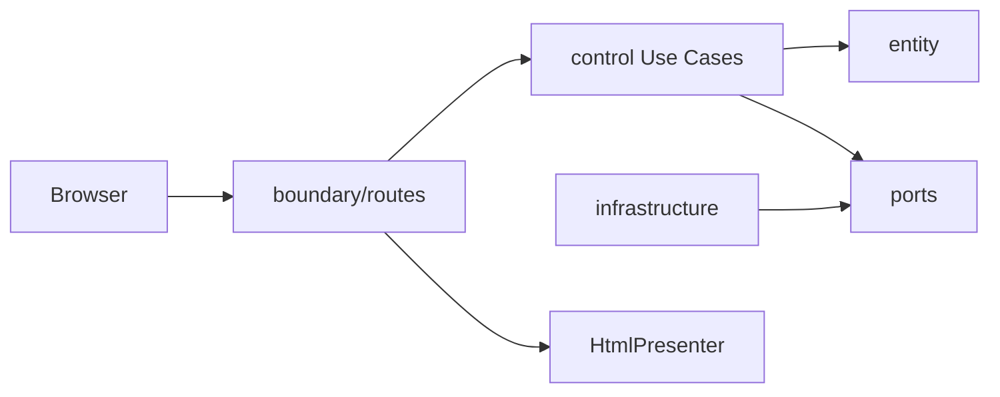

# Feedback Analyzer — 최종 작업 보고서 (QA · 커버리지 · TDD 종합)

| 항목 | 내용 |
|------|------|
| 문서 ID | `20260522_feedbackanalyzer_Python_06_Report` |
| 프로젝트 | Feedback Analyzer — `FeedbackAnalyzer_06` |
| 작성일 | **2026-05-22** |
| 워크스페이스 | `c:\DEV_BR\FeedbackAnalyzer_06` |
| 작업 루트 | `src/python` (Flask, 포트 **8080**) |
| Git 브랜치 | **`refactoring`** (`origin/refactoring`, 기준 커밋 `b30ec32`) |
| TDD 단계 | **RED → GREEN → REFACTOR 완료** (M1·M2 핵심) |
| 보고 범위 | 문서·테스트·결함·아키텍처·커버리지·회귀 (코드 신규 구현 없음) |

**참조 문서**

| 구분 | 경로 |
|------|------|
| 제품 계약 | [`doc/PRD.md`](../doc/PRD.md) v1.1+ |
| 테스트 계획 | [`doc/test_plan.md`](../doc/test_plan.md) v1.0 |
| 결함 이력 | [`doc/defect_list.md`](../doc/defect_list.md) v1.2 |
| 리팩토링 계획·결과 | [`doc/refactoring_plan.md`](../doc/refactoring_plan.md), [`doc/refactoring.md`](../doc/refactoring.md) |
| Gherkin 추적 | [`doc/gherkin_gh01.md`](../doc/gherkin_gh01.md) |
| 운영·학습 | [`README.md`](../README.md) |
| 선행 보고 | [`Report/spec-documentation-work-report.md`](spec-documentation-work-report.md), [`Report/tdd-red-phase-work-report.md`](tdd-red-phase-work-report.md) |

---

## 1. Executive Summary

Feedback Analyzer는 **의도적 코드 스멜**이 포함된 Flask 레거시를 **계약(Invariant)·pytest·BCE 아키텍처**로 개선하는 **리팩토링 챌린지(TDD)** 프로젝트이다.

| 단계 | 일자·브랜치 | 핵심 성과 |
|------|-------------|-----------|
| **Spec** | 2026-05-21 · `spec` | PRD v1.1, README·TO-DO·`.cursorrules` 정합 |
| **RED** | 2026-05-22 | TC-A/B·tobe 52골격, 결함 X-01·X-02·X-09 재현 |
| **GREEN** | 2026-05-22 · `green` → merge | entity/control 구현, **52 passed**, Golden baseline |
| **REFACTOR** | 2026-05-22 · `refactoring` | C-01~C-14, 레거시 4파일 삭제, M2 BCE 런타임 단일화 |

### 1.1 최종 품질 지표 (2026-05-22 실측)

| 지표 | 목표 (PRD/README) | 실측 | 판정 |
|------|-------------------|------|------|
| 전체 pytest | **RR-5** 0 failed | **52 / 52 passed** | **PASS** |
| entity + control 커버리지 | **G-1** ≥ 90% | **99%** (179 stmts, 2 miss) | **PASS** |
| boundary + app 커버리지 | ≥ 85% (README) | **97%** (127 stmts, 4 miss) | **PASS** |
| 전 레이어 커버리지 | — | **98%** (348 stmts, 7 miss) | 참고 |
| Golden Master | GM-TC-01~05 | **5 / 5 PASS** | **PASS** |
| PRD §7.1 핵심 INV | M1 차단 | TC-A/B·tobe·Golden으로 검증 | **PASS** |
| M2 Architecture | ST-05~08 핵심 | BCE·Repository·Presenter | **PASS** (🟢·F-08 제외) |

### 1.2 범위 제외 (의도적)

- **M3:** Trend, File DB, JSON API (`@pytest.mark.mission7`)
- **🟢:** F-08 KeywordRuleRepository, 동적 키워드, PageLogSink(F-14)
- **M4:** `fil`/`sent`/`kw` 네이밍 rename
- **NG-2:** `Cursor AI_퀴즈 - 문제.docx` 미반영

---

## 2. 프로젝트 타임라인

```text
2026-05-21  spec     → PRD·README·계약 정의
2026-05-22  RED      → test_plan, defect_list, pytest 골격 (22 failed / 12 passed 스냅샷)
2026-05-22  GREEN    → SentimentClassifier 단일화, Use Case, X-01/02/09 수정, 52 passed
2026-05-22  REFACTOR → C-01~C-14, infrastructure, boundary 분리, 레거시 삭제
2026-05-22  Close-out → gherkin_gh01, refactoring.md, 본 최종 보고서
```

### 2.1 선행 보고서와의 관계

| 보고서 | 단계 | 본 보고서에서의 위치 |
|--------|------|----------------------|
| [`spec-documentation-work-report.md`](spec-documentation-work-report.md) | Spec | §3 계약·문서 기반 |
| [`tdd-red-phase-work-report.md`](tdd-red-phase-work-report.md) | RED | §5.1 RED QA 스냅샷 |
| [`doc/refactoring.md`](../doc/refactoring.md) | REFACTOR | §6 아키텍처 전·후 |

---

## 3. 문서·산출물 인벤토리

### 3.1 `doc/` 산출물

| 파일 | 버전 | 역할 |
|------|------|------|
| `PRD.md` | v1.1~1.2 | F-01~14, INV, §7.1 인수, RR-1~5 |
| `test_plan.md` | v1.0 | TC-A/B, 경계값 B-*, 회귀 X-*, 커버리지 전략 |
| `defect_list.md` | v1.2 | X-01~X-09 이력·GREEN/REFACTOR 클로저 |
| `refactoring_plan.md` | v1.2 | C-01~C-14 실행·DoD |
| `refactoring.md` | v1.0 | 리팩토링 전·후 결과 |
| `gherkin_gh01.md` | v1.0 | GH-01 8 Scenario 추적·pytest 매핑 |
| `OLD_README.md` | — | 이전 README 보관 |

### 3.2 `Report/` 산출물

| 파일 | 단계 |
|------|------|
| `spec-documentation-work-report.md` | Spec |
| `tdd-red-phase-work-report.md` | RED |
| **`20260522_feedbackanalyzer_Python_06_Report.md`** | **최종 (본 문서)** |

### 3.3 코드·테스트 산출물 (`src/python`)

| 영역 | REFACTOR 후 |
|------|-------------|
| 런타임 | `app.py`, `boundary/`, `control/`, `entity/`, `infrastructure/` |
| 삭제 | `text_analyzer.py`, `filters.py`, `session.py`, `file_handler.py` |
| 테스트 | `tests/entity`, `control`, `boundary`, `tobe`, `golden`, `support` |
| 회귀 기준 | `tests/golden/feedback_golden_master.txt`, `download_filtered_anchor.csv` |

---

## 4. 앵커 시나리오 (QA 기준점)

모든 Track A/B·Golden·결함 분석의 **기준 입력**이다.

| 항목 | 값 |
|------|-----|
| HTTP | `POST /analyze` |
| Body | `text=배송이 너무 늦어요. 화가 납니다.` |
| 기대 감정 | **부정** 1건 (**RR-1 (B):** 키워드 `화가` 추가) |
| 기대 카테고리 | **배송** ≥ 1 |
| INV | INV-COUNT-002, INV-SENT-001~003, INV-TEXT-001 |
| Golden | GM-TC-01 (S1), GM-TC-05 (S5 Filter→Download) |

---

## 5. QA — 테스트 전략·실행 결과

### 5.1 테스트 피라미드 (Dual-Track)

| 우선순위 | 경로 | 건수 | 역할 |
|:--------:|------|------|------|
| P0 | `tests/entity/` | 6 | 도메인·INV 직접 검증 |
| P1 | `tests/control/` | 12 | Use Case·Port·집계·CSV |
| P2 | `tests/boundary/` | 18 | HTTP·HTML·Golden 스모크 |
| — | `tests/tobe/` | 13 | TO-BE entity/control 병렬 검증 |
| **합계** | `tests/` | **52** | RR-5 회귀 게이트 |

### 5.2 RED 단계 스냅샷 (참고)

[`tdd-red-phase-work-report.md`](tdd-red-phase-work-report.md) 기준:

| 구분 | 건수 |
|------|------|
| 총 테스트 | 34 (확장 전 스냅샷) |
| **failed (RED)** | 22 |
| **passed** | 12 |
| Critical 결함 | X-01, X-02, X-09 |

> RED는 **계약 기준 실패를 기록**하는 단계이며, 레거시 통과를 목표로 하지 않았다.

### 5.3 GREEN·REFACTOR 최종 실행 (본 보고서 실측)

**환경:** Windows, Python **3.12.10**, pytest **9.0.3**, pytest-cov **7.1.0**

```bash
cd src/python
.venv\Scripts\python.exe -m pytest -v tests/ --tb=no
```

| 항목 | 결과 |
|------|------|
| Collected | **52** |
| Passed | **52** |
| Failed | **0** |
| Skipped | **0** |
| Duration | ~1.2s (cov 미포함) |

### 5.4 Track A — Boundary (`tests/boundary/`, 18건)

| TC ID | 시나리오 요약 | INV / 결함 | 결과 |
|-------|---------------|------------|------|
| TC-A-01 | 앵커 analyze → 부정·배송·원문 | INV-COUNT-002, X-09 | **PASS** |
| TC-A-02 | 공백-only 미추가 | INV-INPUT-001 | **PASS** |
| TC-A-03 | 0건 filter warning | INV-EMPTY-001 | **PASS** |
| TC-A-04 | filter 부정+배송 → download CSV | INV-CSV-OUT-003 | **PASS** |
| TC-A-05 | 깨진 CSV upload error | INV-SESSION-001 | **PASS** |
| TC-A-06 | 멀티라인 원문 HTML | INV-TEXT-001 | **PASS** |
| TC-A-07 | 알 수 없는 sentiment | PRD C-09 | **PASS** |
| GM-TC-01~05 | Golden Master S1~S5 | 계약 고정 | **PASS** |
| coverage ×6 | index, upload, filter, download, 예외 | G-1 boundary | **PASS** |

### 5.5 Track B — Domain (`tests/entity/` + `tests/control/`, 18건)

| TC ID | 시나리오 요약 | INV | 결과 |
|-------|---------------|-----|------|
| TC-B-01 | 앵커 부정·배송 | INV-COUNT-002 | **PASS** |
| TC-B-02 | 중립-only 문장 | INV-SENT-001 | **PASS** |
| TC-B-03 | 긍·부 동시 → 긍정 우선 | ST-02 | **PASS** |
| TC-B-04a/b | Analyze=Filter 라벨·집계 | INV-SENT-002, X-01 | **PASS** |
| TC-B-05 | 중립 필터만 | INV-SENT-003, X-02 | **PASS** |
| TC-B-06 | N건 합=건수 | INV-COUNT-002 | **PASS** |
| TC-B-07 | empty/whitespace 미추가 | INV-INPUT-001 | **PASS** |
| TC-B-08 | broken/empty CSV | INV-SESSION-001 | **PASS** |
| TC-B-09 | filter snapshot = download | INV-CSV-OUT-003 | **PASS** |
| TC-B-10 | 10_000자 원문 보존 | INV-TEXT-001 | **PASS** |
| TC-B-11 | 카테고리 main+sub | F-03, X-05 | **PASS** |
| TC-B-12 | 부분 문자열 키워드 | constants | **PASS** |
| coverage G-1 ×7 | upload/filter/download 예외 | G-1 | **PASS** |

### 5.6 TO-BE 병렬 검증 (`tests/tobe/`, 13건)

| 영역 | 건수 | 결과 |
|------|------|------|
| `test_entity_red.py` | 6 | **PASS** |
| `test_control_red.py` | 7 | **PASS** |

> RED 당시 STUB 실패 목적이었으나, GREEN·REFACTOR 후 **동일 계약으로 PASS**. Phase 5 `tobe`→`entity|control` 통합은 **선택** 미실행.

### 5.7 PRD 측정 목표 (G-1~G-5) vs QA

| ID | 목표 | 검증 수단 | 최종 |
|----|------|-----------|------|
| G-1 | entity·control cov ≥ 90% | pytest-cov | **99%** |
| G-2 | Analyze=Filter 감정 | TC-B-04 | **PASS** |
| G-3 | 중립 필터 정확 | TC-B-05 | **PASS** |
| G-4 | 감정 건수 합 | TC-B-06 | **PASS** |
| G-5 | 입·출력 계약 | TC-A·Golden | **PASS** |

---

## 6. QA — 결함·회귀 관리

### 6.1 결함 라이프사이클

| ID | Severity | RED | GREEN | REFACTOR | INV |
|----|----------|-----|-------|----------|-----|
| **X-09** | Critical | Failed | **Closed** (RR-1 **B** `화가`) | 유지 | INV-COUNT-002 |
| **X-01** | Critical | Failed | **Closed** (단일 Classifier) | 유지 | INV-SENT-002 |
| **X-02** | Critical | Failed | **Closed** (중립=긍·부 미매칭) | 유지 | INV-SENT-003 |
| X-03 | — | — | Closed (M1) | 유지 | INV-COUNT-002 |
| X-04 | — | — | Closed (M1) | 유지 | INV-CSV-OUT-003 |
| X-05 | Major | — | Closed (TC-B-11) | main+sub | F-03 |
| **X-06** | — | Open | Mitigated | **Closed** (Repository) | — |
| **X-07** | — | Mitigated | Mitigated | **Closed** (Upload 정책) | ADR-03 |
| X-08 | — | — | mitigated | open(선택) | boundary cov |

### 6.2 회귀 방지 규칙 (RR) — 최종 상태

| 규칙 | 내용 | 검증 |
|------|------|------|
| **RR-1** | PRD → Gherkin → README 계약 순 | `gherkin_gh01.md`, X-09 **(B)** |
| **RR-3** | `S_KEYWORDS`·`filters.py` 재도입 금지 | 파일 삭제·grep 0 |
| **RR-4** | `fil_data`·`Session`·`global_*` 금지 | `wiring` + Port |
| **RR-5** | 병합 전 전체 pytest 0 failed | **52/52** |

### 6.3 Golden Master 회귀

| GM ID | 시나리오 | 결과 |
|-------|----------|------|
| GM-TC-01 | S1 앵커 analyze | **PASS** |
| GM-TC-02 | S2 긍정·배송 | **PASS** |
| GM-TC-03 | S3 공백-only 불변 | **PASS** |
| GM-TC-04 | S4 0건 filter warning | **PASS** |
| GM-TC-05 | S5 CSV 바이트 비교 | **PASS** |

**기준 파일:** `tests/golden/feedback_golden_master.txt`, `download_filtered_anchor.csv`  
**정책:** 레거시 RED 출력이 아닌 **GREEN baseline** + RR-1 반영 후 승인.

---

## 7. 커버리지 보고

### 7.1 측정 명령

```bash
cd src/python

# G-1 (PRD/README 목표)
.venv\Scripts\python.exe -m pytest --cov=entity --cov=control --cov-report=term-missing tests/

# Boundary 목표
.venv\Scripts\python.exe -m pytest --cov=app --cov=boundary --cov-report=term-missing tests/boundary/

# 전 레이어 스냅샷
.venv\Scripts\python.exe -m pytest --cov=entity --cov=control --cov=boundary --cov=infrastructure --cov=app --cov-report=term-missing tests/
```

### 7.2 G-1: entity + control (52 tests)

| 모듈 | Stmts | Miss | Cover |
|------|-------|------|-------|
| `control/*` (전 파일) | 103 | 0 | **100%** |
| `entity/sentiment_classifier.py` | 19 | 0 | **100%** |
| `entity/feedback_filter.py` | 20 | 0 | **100%** |
| `entity/ports.py` | 5 | 0 | **100%** |
| `entity/category_classifier.py` | 28 | 2 | **93%** |
| **TOTAL** | **179** | **2** | **99%** |

**미커버:** `category_classifier.py` **28-29** (`aggregate()` 내부 루프 일부)

### 7.3 Boundary: app + boundary (18 tests)

| 모듈 | Stmts | Miss | Cover |
|------|-------|------|-------|
| `app.py` | 8 | 0 | **100%** |
| `boundary/presenter.py` | 58 | 1 | **98%** (line 169) |
| `boundary/routes.py` | 61 | 3 | **95%** (lines 57-59) |
| **TOTAL** | **127** | **4** | **97%** |

### 7.4 전 레이어 (52 tests)

| 레이어 | Cover | Missing lines (요약) |
|--------|-------|----------------------|
| app | 100% | — |
| boundary | 95~98% | presenter 169; routes 57-59 |
| control | 100% | — |
| entity | 93~100% | category_classifier 28-29 |
| infrastructure | 93~100% | memory_filtered_store 22 |
| **TOTAL** | **98%** | 348 stmts, **7 miss** |

### 7.5 커버리지 vs README·PRD 목표

| 목표 | 기준 | 실측 | 판정 |
|------|------|------|------|
| G-1 | entity·control ≥ 90% | **99%** | **초과 달성** |
| README boundary | app ≥ 85% | **97%** (boundary 테스트만) | **초과 달성** |
| README 문구 | “100%” (GREEN 시점) | category **93%** (2 lines) | 문서·실측 소폭 차이 — 기능 영향 없음 |

**QA 권고:** 미커버 7 lines는 **예외·폴백·aggregate 엣지**이며, 릴리스 차단 기준(G-1 90%)에는 해당하지 않는다. 100% 목표 시 `category_classifier.aggregate`·`routes` upload 예외·`presenter.render_vm` 폴백에 단위 테스트 3건 추가 가능.

---

## 8. 아키텍처 — 리팩토링 전·후 (요약)

상세: [`doc/refactoring.md`](../doc/refactoring.md)

| 항목 | 리팩토링 전 (AS-IS) | 리팩토링 후 (TO-BE) |
|------|---------------------|---------------------|
| 진입 | `app.py` God Function | thin `app.py` (~21줄) |
| HTML | 인라인 `render_page` | `boundary/presenter.HtmlPresenter` |
| HTTP | 라우트 내 비즈니스 | `boundary/routes` → Use Case |
| 감정 | `text_analyzer` vs `filters.S_KEYWORDS` | `SentimentClassifier` 단일 |
| 상태 | `Session`, `fil_data`, `global_*` | `infrastructure` Port + `wiring` |
| 이중 트랙 | pytest TO-BE ≠ Flask | **단일 런타임 경로** |
| REFACTOR 커밋 | — | C-01~C-14 (`ba006e3`~`91564d7`) + `b30ec32` 문서 |



---

## 9. README TO-DO · 마일스톤 최종

[`README.md`](../README.md) TO-DO LIST 기준 (2026-05-22):

| 마일스톤 | 상태 | 비고 |
|----------|------|------|
| **M1 v1.0 Domain** | **완료** | 🔴 Must-Have 전부 `[x]` |
| **M2 v1.1 Architecture** | **핵심 완료** | BCE·Repository·Presenter·cov; F-08·PageLogSink·🟢 제외 |
| **M3 v2.0 Extension** | **미착수** | Trend·JSON·File DB |
| **M4 Debt sweep** | **부분** | Lava 삭제 완료; 네이밍 rename `[ ]` |

### 9.1 미완 체크리스트 (의도적)

- KeywordRuleRepository, 동적 키워드 (🟢/mission7)
- PageLogSink (선택)
- Trend, File DB, JSON API (M3)
- `tests/tobe/` 통합 (선택)
- M4 네이밍 `fil`/`sent`/`kw`

---

## 10. 리스크·의사결정 기록

| ID | 결정 | QA 영향 |
|----|------|---------|
| RR-1 **(B)** | 앵커 문장 유지 + `화가` 키워드 | TC-A-01, TC-B-01, GM-TC-01 일관 |
| ADR-03 | Upload 후 자동 재분석 없음 | TC-B-08·boundary upload PASS (정책) |
| ADR-05 | `tests/tobe/` 유지 | 13건 중복 검증 — 회귀 안전망 |

---

## 11. 결론 및 권고

### 11.1 결론

1. **TDD 3단계(RED·GREEN·REFACTOR)** 를 계약·pytest·문서와 함께 완료하였다.  
2. **QA:** 52건 전수 통과, 핵심 INV·Golden·TO-BE 병렬 검증으로 **M1 인수 기준 충족**.  
3. **커버리지:** G-1(90%)·boundary(85%) **초과 달성** (99% / 97%).  
4. **아키텍처:** M2 BCE·Port·Presenter 분리 완료, 레거시 이중 규칙·전역 상태 제거.  
5. **문서:** `doc/` 7종 + `Report/` 3종으로 Spec→RED→최종 추적 가능.

### 11.2 권고 (다음 작업)

| 우선순위 | 작업 | 시작 단계 |
|----------|------|-----------|
| P1 | `refactoring` → `main` PR·리뷰 | 회귀 52 passed 첨부 |
| P2 | M3 mission7 (Trend·File DB) | RED + `@pytest.mark.mission7` |
| P3 | F-08 KeywordRule | RED (Port + OCP) |
| P4 | 커버리지 100% (선택) | entity aggregate·routes 예외 |
| P5 | M4 네이밍 rename | REFACTOR only |

### 11.3 승인 체크리스트 (릴리스 게이트)

- [x] `pytest -v tests/` → 0 failed  
- [x] `pytest tests/boundary/test_golden_master.py` → 5/5  
- [x] entity+control cov ≥ 90%  
- [x] RR-3·RR-4 정적 위반 없음 (레거시 파일 삭제)  
- [x] PRD §7.1 핵심 INV TC 매핑 PASS  
- [ ] M3·🟢 기능 (비차단)  
- [ ] 운영 배포·인증 (NG-3, 비목표)  

---

## 12. 부록

### 12.1 pytest 실행 로그 요약 (최종)

```
52 passed in ~1.2s
platform: win32, Python 3.12.10, pytest 9.0.3
```

### 12.2 관련 커밋 (REFACTOR)

`ba006e3` C-01 … `91564d7` C-14 · `b30ec32` docs(m2) close REFACTOR follow-ups

### 12.3 문서 이력

| 버전 | 일자 | 변경 |
|------|------|------|
| 1.0 | 2026-05-22 | 최종 QA·커버리지·TDD 종합 보고서 초판 |

---

*본 보고서는 [`doc/`](../doc/), [`Report/`](.), [`README.md`](../README.md) 및 2026-05-22 로컬 pytest·pytest-cov 실측을 근거로 작성되었다.*
