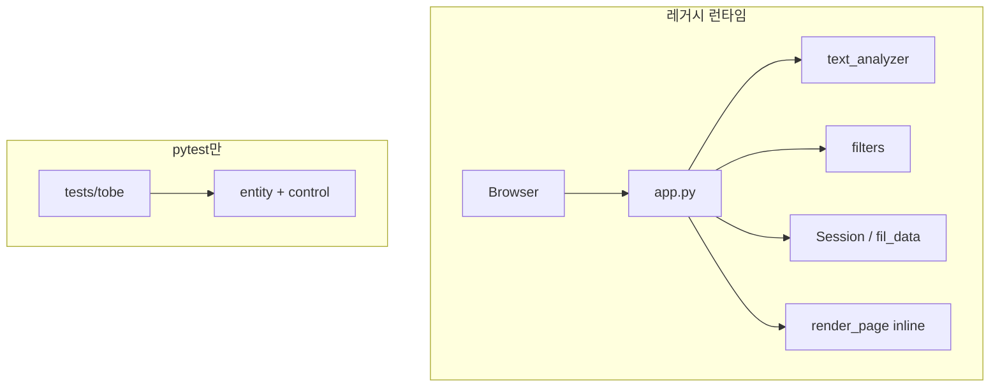
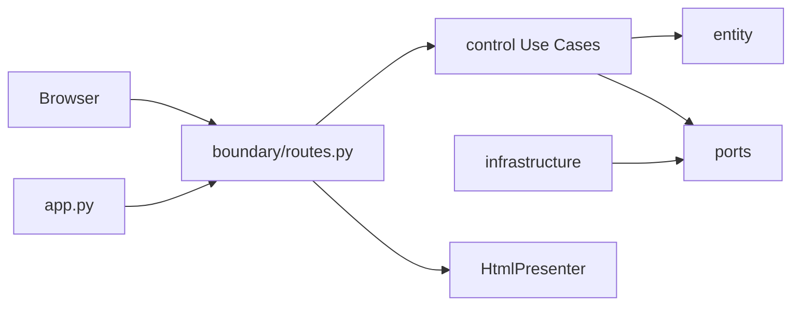

# Feedback Analyzer — 리팩토링 작업 결과 보고서

| 항목 | 값 |
|------|-----|
| 문서 버전 | 1.0 |
| 작성일 | 2026-05-22 |
| 프로젝트 | Feedback Analyzer (`FeedbackAnalyzer_06`) |
| 작업 루트 | `src/python` |
| Git 브랜치 | `refactoring` (`origin/refactoring`) |
| 기준 커밋 | `b30ec32` (문서·후속 정리) · REFACTOR 본선 `ba006e3`~`91564d7` (C-01~C-14) |
| 선행 단계 | M1 GREEN (`527cb14` merge) — 52 passed 달성 후 REFACTOR 착수 |
| 실행 계획서 | [`doc/refactoring_plan.md`](refactoring_plan.md) |
| 관련 문서 | [`PRD.md`](PRD.md), [`test_plan.md`](test_plan.md), [`defect_list.md`](defect_list.md), [`gherkin_gh01.md`](gherkin_gh01.md), [`README.md`](../README.md) |

---

## 1. 보고서 요약

본 프로젝트는 **레거시 Flask 모놀리스**를 TDD(RED → GREEN → REFACTOR)로 개선하는 학습용 **리팩토링 챌린지**이다.  
**REFACTOR(M2 Architecture)** 단계를 완료하여, 런타임이 **Boundary → Control → Entity ← Infrastructure** 단일 경로로 동작하도록 정리했다.

| 구분 | 한 줄 |
|------|--------|
| **리팩토링 전** | `app.py`에 HTML·라우팅·분석·필터·전역 상태가 혼재; `text_analyzer`/`filters` 이중 감정 규칙; `entity`/`control`은 테스트 전용(**이중 트랙**) |
| **리팩토링 후** | thin `app.py` + `boundary`/`control`/`entity`/`infrastructure`; 레거시 4모듈 삭제; HTTP가 Use Case를 직접 호출 |
| **품질 게이트** | `pytest tests/` **52 passed** · entity+control 커버리지 **99%** · Golden **5/5 PASS** |
| **범위 제외** | M3(Trend·JSON API·File DB), F-08 KeywordRule, F-14 PageLogSink 등 **🟢 선택/mission7** |

---

## 2. 작업 배경 및 목적

### 2.1 프로젝트 목적

[`project_purpose.md`](../project_purpose.md)에 정의된 대로, 학습자는 의도적으로 포함된 코드 스멜을 식별하고 **모듈화·책임 분리·테스트 가능한 구조**로 개선한다.

### 2.2 M2 리팩토링 목표 (3가지)

| # | 목표 | PRD·규칙 | 결과 |
|---|------|----------|------|
| 1 | 상태·의존 단일화 | F-09, **RR-4** | `MemoryFeedbackRepository`, `MemoryFilteredResultStore`, `wiring` |
| 2 | 감정·필터 도메인 단일 허브 | F-02, **RR-3** | `SentimentClassifier` + `FeedbackFilter`; `S_KEYWORDS`·`filters.py` 제거 |
| 3 | BCE·Presenter 분리 | F-07, F-10 | `boundary/routes.py`, `boundary/presenter.py`, Use Case 4종 |

### 2.3 TDD 단계별 위치

```text
[레거시 AS-IS]
        ↓ RED (2026-05-22) — TC-A/B·tobe·결함 X-01,X-02,X-09 기록
        ↓ GREEN (2026-05-22) — entity/control 구현·52 passed·Golden baseline
        ↓ REFACTOR (2026-05-22) — C-01~C-14 + 문서·후속 정리 (b30ec32)
[현재 TO-BE 런타임]
```

**원칙:** REFACTOR 중 **동작 변경 없음**(구조·이름·위치만). 실패 테스트 0건 유지(**RR-5**).

---

## 3. 리팩토링 전 (AS-IS)

### 3.1 파일·책임 구조

| 파일/모듈 | 역할 | 주요 문제 |
|-----------|------|-----------|
| `app.py` | Flask 진입·라우트·`render_page()` HTML | God Function, UI·애플리케이션·도메인 혼재 |
| `text_analyzer.py` | Analyze 경로 감정·키워드 | `SENTIMENT_KEYWORDS` 사용 |
| `filters.py` | Filter 경로 감정·카테고리 | 별도 `S_KEYWORDS` (**RR-3** 위반) |
| `session.py` | `Session` 클래스 변수 피드백 보관 | 테스트·요청 간 격리 어려움 (**X-06**) |
| `app` 전역 | `fil_data`, `global_sent`, `global_kw` | **RR-4** 전역 mutable |
| `file_handler.py` | 파일 저장 | Lava Flow(미사용) |
| `entity/`, `control/` | TO-BE 스켈레톤 | **런타임 미연동**(이중 트랙) |

### 3.2 아키텍처 (개념)



### 3.3 RED 단계에서 확인된 핵심 결함

| ID | 요약 | INV |
|----|------|-----|
| **X-09** | 앵커 `화가` vs 키워드 `화남` 불일치 → Analyze 부정 미집계 | INV-COUNT-002 |
| **X-01** | Analyze·Filter 감정 라벨 불일치 (`SENTIMENT_KEYWORDS` ≠ `S_KEYWORDS`) | INV-SENT-002 |
| **X-02** | 중립 필터가 `S_KEYWORDS["중립"]` 목록 사용 | INV-SENT-003 |

**RR-1 결정:** **(B)** `SENTIMENT_KEYWORDS["부정"]`에 `화가` 추가, 데모 문장 유지.

---

## 4. GREEN 단계 요약 (REFACTOR 선행 조건)

REFACTOR 착수 전 **M1 GREEN**을 완료하였다 (`527cb14` — PR #4 merge).

| 항목 | 결과 |
|------|------|
| entity·control 최소 구현 | `SentimentClassifier`, `CategoryClassifier`, `FeedbackFilter`, 4 Use Case |
| 결함 클로저 | X-01, X-02, X-09 수정 |
| 전체 pytest | **52 passed** |
| Golden Master | GM-TC-01~05 baseline 확정 |
| G-1 커버리지 | entity+control **≥ 90%** (당시 100% 목표 달성) |

> GREEN은 **동작을 맞추는 단계**, REFACTOR는 **구조를 맞추는 단계**로 분리하였다.

---

## 5. REFACTOR 수행 내역

### 5.1 Phase·커밋 매핑 (C-01~C-14)

| Phase | 범위 | 커밋 (요약) | 주요 산출물 |
|-------|------|-------------|-------------|
| **1 Infrastructure** | C-01~C-03 | `ba006e3`~`a89c7ae` | `FeedbackRepositoryPort`, `FilteredResultStorePort`, `infrastructure/*`, `fil_data` 제거 |
| **2 Entity 단일화** | C-04~C-06 | `24fd4da`~`1c32540` | `FeedbackFilter` entity 경로, `S_KEYWORDS` 삭제, TextAnalyzer→Classifier 위임 |
| **3 Control 연동** | C-07~C-10 | `3f889a0`~`fabc819` | `/analyze`, `/upload`, `/filter`, `/download` → Use Case |
| **4 Boundary** | C-11~C-12 | `eab895d`~`dde65e0` | `HtmlPresenter`, `boundary/routes` Blueprint, thin `app.py` |
| **5 부채 정리** | C-13~C-14 | `18124d3`~`91564d7` | `text_analyzer`, `filters`, `session`, `file_handler` **삭제** |

### 5.2 REFACTOR 후속 정리 (`b30ec32`)

| 항목 | 내용 |
|------|------|
| 문서 | `refactoring_plan.md`, `gherkin_gh01.md`, README·defect_list·PRD 동기화 |
| 코드 품질 | `CategoryClassifier` **main+sub** (F-03), Presenter `wiring` 의존 제거, STUB docstring 정리 |
| 결함 | X-06(Session), X-07(Upload 정책) **closed** |

### 5.3 의사결정 유지 (ADR)

| ID | 결정 | 비고 |
|----|------|------|
| ADR-01 | X-09 **(B)** `화가` 키워드 | 데모·Golden·TC-A-01 일관 |
| ADR-03 | CSV Upload 후 **자동 재분석 없음** | append only; X-07 정책 |
| ADR-05 | `tests/tobe/` **유지** | entity/control 통합은 선택(Phase 5) |

---

## 6. 리팩토링 후 (TO-BE)

### 6.1 디렉터리 구조

```text
src/python/
├── app.py                      # Composition root (~21줄)
├── boundary/
│   ├── routes.py               # HTTP → Use Case
│   └── presenter.py            # HtmlPresenter (F-10)
├── control/
│   ├── analyze_feedback.py
│   ├── upload_csv.py
│   ├── filter_feedbacks.py
│   ├── download_filtered.py
│   └── dto.py
├── entity/
│   ├── sentiment_classifier.py
│   ├── category_classifier.py
│   ├── feedback_filter.py
│   └── ports.py
├── infrastructure/
│   ├── memory_feedback_repository.py
│   ├── memory_filtered_store.py
│   └── wiring.py
├── constants.py, feedback.py, logger.py
└── tests/                      # boundary, entity, control, golden, tobe
```

**삭제된 레거시:** `text_analyzer.py`, `filters.py`, `session.py`, `file_handler.py`

### 6.2 아키텍처 (개념)



### 6.3 HTTP 라우트 ↔ Use Case

| HTTP | Use Case | Entity/Infrastructure |
|------|----------|------------------------|
| `POST /analyze` | `AnalyzeFeedbackUseCase` | Repository, Sentiment/CategoryClassifier |
| `POST /upload` | `UploadCsvUseCase` | Repository |
| `POST /filter` | `FilterFeedbacksUseCase` | Repository, Store, FeedbackFilter |
| `GET /download` | `DownloadFilteredUseCase` | FilteredResultStore |

---

## 7. 전·후 비교

### 7.1 구조·책임

| 항목 | 리팩토링 전 | 리팩토링 후 |
|------|-------------|-------------|
| 진입점 | `app.py` (God) | `app.py` (Blueprint 등록만) |
| HTML | `render_page` 인라인 | `boundary/presenter.HtmlPresenter` |
| 감정 규칙 | 2벌 (`SENTIMENT_KEYWORDS` / `S_KEYWORDS`) | `SentimentClassifier` 1벌 |
| 피드백 저장 | `Session` 클래스 변수 | `MemoryFeedbackRepository` |
| 필터 스냅샷 | `fil_data` 전역 | `MemoryFilteredResultStore` |
| 런타임 vs 테스트 | 이중 트랙 | **단일 트랙** |
| 죽은 코드 | `file_handler.py` | 삭제 |

### 7.2 회귀 방지 규칙 (RR)

| 규칙 | 리팩토링 전 위험 | 리팩토링 후 |
|------|------------------|-------------|
| **RR-3** | `S_KEYWORDS` 재도입 가능 | `filters.py` 없음 — 위반 경로 제거 |
| **RR-4** | `fil_data`, `Session`, `global_*` | `wiring` + Port만 사용 |
| **RR-5** | — | 52/52 passed 유지 |

### 7.3 결함 상태

| ID | RED | GREEN | REFACTOR |
|----|-----|-------|----------|
| X-01 | Failed | Closed | 유지 |
| X-02 | Failed | Closed | 유지 |
| X-09 | Failed | Closed (RR-1 B) | 유지 |
| X-06 | Open | Mitigated | **Closed** (Repository) |
| X-07 | Mitigated | Mitigated | **Closed** (정책 명시) |

### 7.4 PRD·마일스톤

| 마일스톤 | REFACTOR 전 | REFACTOR 후 |
|----------|-------------|-------------|
| **M1 Domain** | GREEN 완료 | 유지 (INV green) |
| **M2 Architecture** | 계획·스켈레톤 | **핵심 완료** (🟢·F-08 제외) |
| **M3 Extension** | 미착수 | 미착수 |

---

## 8. 검증 결과 (테스트·커버리지)

**실행 환경:** Windows, Python 3.12.10, pytest 9.0.3, pytest-cov 7.1.0  
**명령:** `cd src/python` → `.venv\Scripts\python.exe -m pytest …`

### 8.1 전체 테스트

| 항목 | 결과 |
|------|------|
| `pytest -v tests/` | **52 collected, 52 passed**, 0 failed |
| boundary | 18 (TC-A 7 + Golden 5 + coverage 6) |
| control | 12 |
| entity | 6 |
| tobe | 13 |
| Golden Master | GM-TC-01~05 **PASS** |

### 8.2 커버리지 (2026-05-22 실측)

| 측정 범위 | 명령 | Stmts | Cover | G-1/목표 |
|-----------|------|-------|-------|----------|
| entity + control | `--cov=entity --cov=control tests/` | 179 | **99%** | ≥ 90% **달성** |
| app + boundary | `--cov=app --cov=boundary tests/boundary/` | 306 | **98%** | app ≥ 85% **달성** |
| 전 레이어 | entity+control+boundary+infrastructure+app | 348 | **98%** | — |

**미커버 요약 (기능 영향 낮음):**

| 위치 | Cover | 비고 |
|------|-------|------|
| `category_classifier.py` 28-29 | 93% | `aggregate()` 일부 루프 |
| `presenter.py` 169 | 98% | `render_vm` 폴백 분기 |
| `routes.py` 57-59 | 95% | upload 예외 분기 |
| `memory_filtered_store.py` 22 | 93% | 엣지 1 line |

### 8.3 PRD 측정 목표 (G-1~G-5)

| ID | 목표 | REFACTOR 후 |
|----|------|-------------|
| G-1 | entity·control cov ≥ 90% | **99%** |
| G-2 | INV-SENT-002 | TC-B-04 **PASS** |
| G-3 | INV-SENT-003 | TC-B-05 **PASS** |
| G-4 | INV-COUNT-002 | TC-B-06 **PASS** |
| G-5 | 입·출력 계약 | TC-A·Golden **PASS** |

---

## 9. 코드 스멜 대응표

[`project_purpose.md`](../project_purpose.md) §4 및 [`refactoring_plan.md`](refactoring_plan.md) §2.3 기준.

| 스멜 | 리팩토링 전 | 리팩토링 후 |
|------|-------------|-------------|
| 긴 함수 / God Function | `app.render_page` | `HtmlPresenter` + thin routes |
| 중복 `_contains_any` | text_analyzer + filters | entity 내부 단일화 |
| 이중 감정 표 | `S_KEYWORDS` | 삭제 |
| 전역 mutable | fil_data, global_sent/kw | Port + wiring |
| Lava Flow | file_handler | 삭제 |
| 부적절한 네이밍 (fil/sent/kw) | 잔존 가능 | **M4 미착수** |
| UI·도메인 결합 | app + constants in HTML | Presenter 분리 (CATEGORIES 결합 잔여) |

---

## 10. 미완·후속 작업 (의도적 제외)

🟢 **선택/mission7·M3** — 본 REFACTOR 범위 밖.

| 항목 | Story/기능 | 상태 |
|------|------------|------|
| KeywordRuleRepository | F-08, ST-06 | 미착수 |
| 동적 키워드 등록 | ST-06 | 미착수 |
| PageLogSink | F-14, ST-07 | 미착수 (`Logger` print 유지) |
| Trend·File DB | F-11, F-12, ST-09 | M3 |
| JSON API | F-13, ST-10 | M3 |
| `tests/tobe/` 통합 | Phase 5 선택 | 13건은 계속 PASS |
| M4 네이밍 rename | fil/sent/kw | **완료** — [`features_extension.md`](features_extension.md) |
| F-15 가중치 감성 | — | **완료** |
| F-16 FileHandler | — | **완료** (C-14 삭제 후 재구현) |

**SRP 잔여 (기능 무관):** Presenter↔`CATEGORIES` 결합, routes의 `Logger`, Control 내 CSV 조립.

---

## 11. 산출물·문서 목록

| 산출물 | 경로 | 역할 |
|--------|------|------|
| 실행 계획서 | [`doc/refactoring_plan.md`](refactoring_plan.md) | C-01~C-14·DoD·ADR |
| **본 보고서** | [`doc/refactoring.md`](refactoring.md) | 전·후 결과 종합 |
| 결함 목록 | [`doc/defect_list.md`](defect_list.md) | X-01~X-09 이력 |
| Gherkin 추적 | [`doc/gherkin_gh01.md`](gherkin_gh01.md) | GH-01 8 Scenario |
| 테스트 계획 | [`doc/test_plan.md`](test_plan.md) | TC-A/B 매핑 |
| Golden | `src/python/tests/golden/` | HTTP·CSV 계약 고정 |
| M4 Extension | [`doc/features_extension.md`](features_extension.md) | F-15·F-16·명명·TEST_F |

---

## 12. M4 Extension (REFACTOR 이후)

| 항목 | 내용 |
|------|------|
| 가중치 감성 | `SentimentClassifier.scoreSentiment` / `analyzeSentiment` |
| FileHandler | `infrastructure/file_handler.py`, `data/exports/session_feedbacks.csv` |
| 명명 | `FeedbackAnalyzer`, `FilterResult`, `getCurrentFeedbacks` |
| 테스트 | **64 passed** ( +12 `TEST_F` ), Golden **5/5** 유지 |

상세: [`doc/features_extension.md`](features_extension.md)

---

## 13. 결론

1. **M2 Architecture REFACTOR** 목표(상태 단일화·감정 단일 허브·BCE 분리)를 **C-01~C-14**로 달성하였다.  
2. **M4 Extension:** 가중치 감성·FileHandler·C++ 명명을 추가하고 **64 passed**·Golden 회귀를 유지하였다.  
3. **이중 트랙 해소:** HTTP 요청이 GREEN 단계에서 검증한 **동일 entity/control** 을 사용한다.  
4. **문서·계약 정합:** RR-1 `(B) 화가`, Gherkin·README·PRD·test_plan·features_extension 반영.  
5. **다음 단계:** M3(🟢), F-08 KeywordRule, Trend·JSON API.

---

## 14. 문서 이력

| 버전 | 일자 | 변경 |
|------|------|------|
| 1.0 | 2026-05-22 | REFACTOR 전·후 작업 결과 보고서 초판 |
| 1.1 | 2026-05-22 | M4 Extension(F-15·F-16·명명) 반영 |
