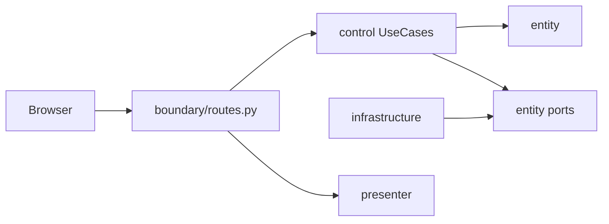

# Feedback Analyzer — 종합 리팩토링 계획서 (M2 Architecture)

| 항목 | 값 |
|------|-----|
| 문서 버전 | **1.2 (실행 완료 반영)** |
| 작성일 | 2026-05-22 |
| 실행 완료일 | 2026-05-22 |
| Git | 브랜치 `refactoring` · 커밋 **C-01~C-14** · `origin/refactoring` |
| 범위 | `src/python` — REFACTOR (M2~M4 핵심), **M3 mission7·🟢 선택 제외** |
| 회귀 | `pytest -v tests/` → **52 passed**, 0 failed |
| 참조 | [`README.md`](../README.md), [`PRD.md`](PRD.md), [`test_plan.md`](test_plan.md), [`defect_list.md`](defect_list.md), [`.cursorrules`](../.cursorrules) |

---

## 1. Executive Summary

### 1.1 현재·목표 한 줄

| 구분 | 한 줄 요약 |
|------|-----------|
| **실행 전 AS-IS** | Flask `app.py`가 HTML·라우팅·`TextAnalyzer`·`filters`·`Session`·`fil_data`를 직접 다루며, `entity/`·`control/`는 pytest에서만 동작하는 **이중 트랙**이었다. |
| **실행 후 (현재)** | `boundary → control → entity ← infrastructure` 단일 런타임 경로; `app.py`는 Blueprint 등록만; 레거시 4파일 삭제. |

### 1.2 리팩터 목표 3개 — 달성 여부

| # | 목표 | 상태 |
|---|------|------|
| 1 | 상태·의존 단일화 (F-09, RR-4) | **완료** — `MemoryFeedbackRepository`, `MemoryFilteredResultStore`, `wiring` |
| 2 | 도메인 단일 허브 (F-02, RR-3) | **완료** — `text_analyzer`/`filters`/`S_KEYWORDS` 삭제 |
| 3 | BCE·Presenter (F-07, F-10) | **완료** — `boundary/routes.py`, `boundary/presenter.py`, Use Case 4개 연동 |

### 1.3 비목표 3개 (유지)

1. **M3 신기능:** Trend, File DB, JSON API — 미착수.
2. **assert 완화·테스트 삭제** — 없음.
3. **NG-2** — 미반영.

### 1.4 성공 기준 — 달성

| ID | 기준 | 결과 |
|----|------|------|
| S-1 | `pytest -v tests/` 0 failed | **52 passed** |
| S-2 | PRD §7.1 INV green | **통과** (TC-A/B, Golden, tobe) |
| S-3 | entity+control cov ≥ 90% | **100%** |
| S-4 | `app.py` thin | **~20줄** composition root |
| S-5 | `entity` Flask import 없음 | **0건** |
| S-6 | Golden Master PASS | **GM-TC-01~05 PASS** |

---

## 2. 현황 진단 (Evidence-based)

### 2.1 ECB 레이어 매핑 표 (REFACTOR 완료 후)

| 레이어 | 현재 파일 | 연동 | 비고 |
|--------|-----------|------|------|
| **Boundary** | `boundary/routes.py`, `boundary/presenter.py`, `app.py` | **런타임 연동** | F-10; Presenter는 `wiring` 미참조 (2026-05-22 정리) |
| **Control** | `control/*_use_case.py`, `dto.py` | **런타임 연동** | 4 라우트 위임 |
| **Entity** | `entity/*_classifier.py`, `feedback_filter.py`, `ports.py` | **런타임·테스트** | Flask 없음 |
| **Infrastructure** | `infrastructure/memory_*.py`, `wiring.py` | **런타임** | Session/fil_data 대체 |
| **삭제** | `text_analyzer`, `filters`, `session`, `file_handler` | — | C-13~C-14 |

### 2.2 이중 트랙 — 해소됨



**이전:** pytest TO-BE 경로와 Flask 경로 분리 → **현재:** 동일 Use Case·Entity를 HTTP가 호출.

### 2.3 코드 스멜 Top 10 — 조치 결과

| 순위 | 스멜 | 조치 |
|------|------|------|
| H1 | God `render_page` | → `HtmlPresenter` (C-11) |
| H2 | 라우트 SRP | → `boundary/routes.py` (C-12) |
| H3 | `fil_data` | → `filtered_store` (C-03) |
| H4 | `Session` | → `feedback_repository` (C-01) |
| H5 | `global_sent`/`global_kw` | → 삭제 (C-05, C-13) |
| H6 | `file_handler` Lava | → 삭제 (C-14) |
| H7 | `S_KEYWORDS` | → 삭제 (C-04) |
| H8 | `download` 검증 | → `DownloadFilteredUseCase` (C-10) |
| M9 | `_contains_any` 중복 | → entity 내부화 |
| M10 | Upload 후 미재분석 | **의도 유지** (ADR-03 A) — X-07 |

---

## 3. 리팩터 목표 아키텍처 (TO-BE) — 달성 상태

### 3.1 디렉터리 트리 (현재)

```text
src/python/
├── app.py
├── boundary/          # routes + presenter
├── control/           # 4 use cases + dto
├── entity/            # classifiers, filter, ports
├── infrastructure/    # repository, store, wiring
├── constants.py
├── feedback.py
├── logger.py
└── tests/             # boundary, entity, control, golden, tobe
```

### 3.2 Port 목록

| Port | 구현 | 상태 |
|------|------|------|
| `FeedbackRepositoryPort` | `MemoryFeedbackRepository` | **완료** |
| `FilteredResultStorePort` | `MemoryFilteredResultStore` | **완료** |
| `KeywordRuleRepository` | — | **미착수** (🟢/ST-06) |

---

## 4. 단계별 실행 계획 — 완료 요약

| Phase | 상태 | 커밋 | 비고 |
|-------|------|------|------|
| 0 게이트 | **완료** | — | 52 passed 기준 |
| 1 Infrastructure | **완료** | C-01~C-03 | Repository·Store |
| 2 Entity 단일화 | **완료** | C-04~C-06 | 레거시 삭제 준비 |
| 3 Control 연동 | **완료** | C-07~C-10 | 4 라우트 |
| 4 Boundary 분리 | **완료** | C-11~C-12 | Presenter·Blueprint |
| 5 부채 정리 | **완료** | C-13~C-14 | 4파일 삭제 |

---

## 5. 1 TC = 1 커밋 — 실행 기록

| 순번 | 목표 | Phase | 상태 |
|------|------|-------|------|
| C-01 | FeedbackRepository + infra | 1 | **완료** `ba006e3` |
| C-02 | FilteredResultStore | 1 | **완료** `226741f` |
| C-03 | app → Store (`fil_data` 제거) | 1 | **완료** `a89c7ae` |
| C-04 | FeedbackFilter, `S_KEYWORDS` 삭제 | 2 | **완료** `24fd4da` |
| C-05 | TextAnalyzer → classifier | 2 | **완료** `ada2965` |
| C-06 | legacy_labels 통일 | 2 | **완료** `1c32540` (marker) |
| C-07 | Analyze UseCase ← `/analyze` | 3 | **완료** `3f889a0` |
| C-08 | Upload UseCase | 3 | **완료** (C-07 포함·marker `c102cfb`) |
| C-09 | Filter UseCase | 3 | **완료** `be48988` |
| C-10 | Download UseCase | 3 | **완료** (C-09 포함·marker `fabc819`) |
| C-11 | HtmlPresenter | 4 | **완료** `eab895d` |
| C-12 | routes blueprint | 4 | **완료** (C-11 포함·marker `dde65e0`) |
| C-13 | 레거시 3파일 삭제 | 5 | **완료** `18124d3` |
| C-14 | file_handler 삭제 | 5 | **완료** `91564d7` |

---

## 6. 테스트·회귀 전략 — 결과

| 항목 | 결과 |
|------|------|
| RR-5 | **52 passed** |
| RR-3 | `S_KEYWORDS`·`filters.py` **없음** |
| RR-4 | `fil_data`·`Session`·`global_sent` **없음** |
| Golden | 5/5 PASS |
| `tests/tobe/` | 13건 PASS (병렬 검증, 통합은 선택) |

---

## 7. 위험·의사결정 — 최종

| ID | 결정 |
|----|------|
| ADR-01 | X-09 **(B)** `화가` — 유지 |
| ADR-03 | Upload 후 **append만** — 유지 |
| ADR-05 | `tests/tobe/` **유지** (Phase 5 통합 미실행) |

---

## 8. 일정·마일스톤

| 마일스톤 | 상태 |
|----------|------|
| **M1 Domain** | **완료** |
| **M2 Architecture** | **핵심 완료** (F-08·ST-06·F-14·🟢 제외) |
| **M3 Extension** | **미착수** |

---

## 9. 인수 기준 (Definition of Done)

- [x] PRD §7.1 INV 전부 green (REFACTOR 후 TC-A/B·Golden)
- [x] README M2 🟡·🔵 **핵심** 항목 `[x]` — KeywordRule·PageLogSink·🟢 제외
- [x] `entity` 패키지 Flask import 없음
- [x] 이중 감정 규칙 재도입 없음 (**RR-3**)
- [x] `pytest -v tests/` 0 failed (**RR-5**)
- [x] entity+control cov ≥ 90% (**G-1**)
- [x] `app.py` thin
- [x] Golden Master PASS

### 9.1 REFACTOR 후에도 미완 (의도적·선택)

| 항목 | 사유 |
|------|------|
| F-08 `KeywordRuleRepository` | 🟢/mission7 · ST-06 |
| F-14 `PageLogSink` | 미션3 선택 |
| F-11~F-13 Trend·JSON·File DB | M3 |
| Gherkin 본문 일괄 갱신 | **완료** — [`doc/gherkin_gh01.md`](gherkin_gh01.md) |
| `tests/tobe/` 통합 | Phase 5 선택 |
| M4 네이밍 fil/sent/kw | 미션4 |

### 9.2 SRP 잔여 (코드 품질, 기능 아님)

| 항목 | 상태 |
|------|------|
| Presenter `CATEGORIES` 결합 | UI·설정 결합 — F-08 시 분리 |
| `Logger` in routes | PageLogSink 미착수 |
| CSV 조립 in Control | 허용 범위 |

---

## 10. 부록

### 10.1 파일별 After 책임 (현재)

| 파일/패키지 | 책임 |
|-------------|------|
| `app.py` | Composition root |
| `boundary/routes.py` | HTTP → Use Case |
| `boundary/presenter.py` | HTML ViewModel 렌더 |
| `control/*` | Application services |
| `entity/*` | Domain rules |
| `infrastructure/*` | Port adapters |

### 10.2 README 체크리스트 매핑

| README 섹션 | 본 계획 |
|-------------|---------|
| [REFACTOR 단계 To-Do](../README.md#refactor-단계-to-do-리스트) | §5 C-01~C-14 |
| [TO-DO M2 🟡·🔵](../README.md#to-do-list) | §9 DoD |
| [회귀 RR-3·RR-4](../README.md#-회귀-방지-체크리스트) | §6 |

---

## 11. 문서·후속 작업 (2026-05-22)

| 작업 | 상태 |
|------|------|
| README Overview·TO-DO·REFACTOR 섹션 갱신 | **완료** |
| 본 계획서 v1.2 실행 반영 | **완료** |
| Presenter `wiring` 의존 제거 | **완료** |
| STUB docstring 정리 (`filter_feedbacks`, `ports`, `__init__`) | **완료** |
| `defect_list` X-06·X-07 | **closed** (Repository·Upload 정책) |
| `doc/gherkin_gh01.md` | **완료** |
| `CategoryClassifier` main+sub (F-03) | **완료** |

---

## 문서 이력

| 버전 | 일자 | 변경 |
|------|------|------|
| 1.0 | 2026-05-22 | M2 REFACTOR 종합 계획 초안 |
| 1.1 | 2026-05-22 | (미발행) |
| 1.2 | 2026-05-22 | C-01~C-14 실행 완료·DoD·README 동기화·SRP 정리 |
